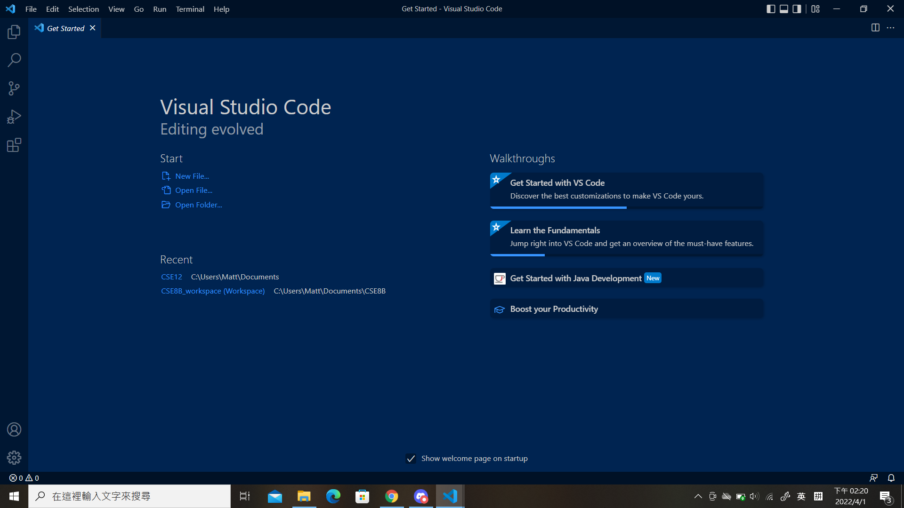
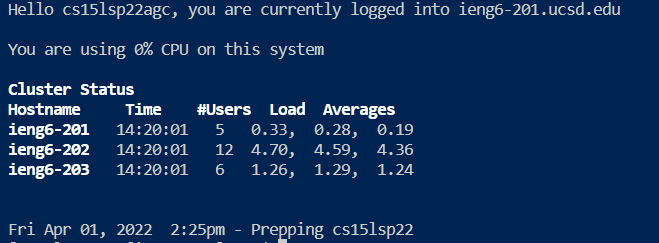
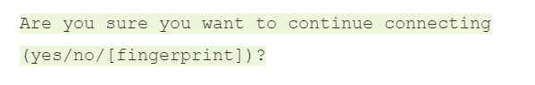
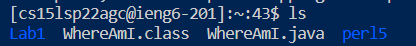
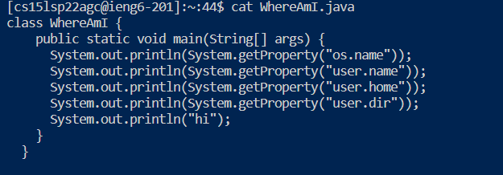
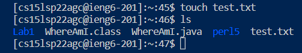
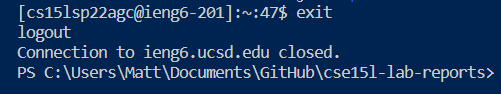
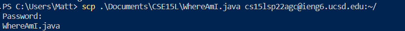
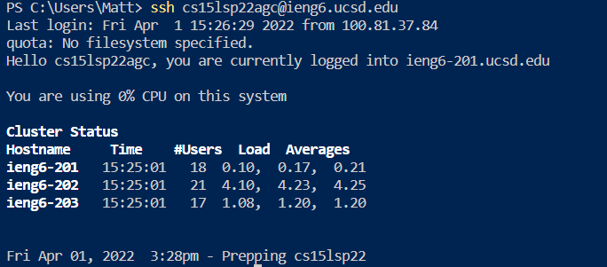
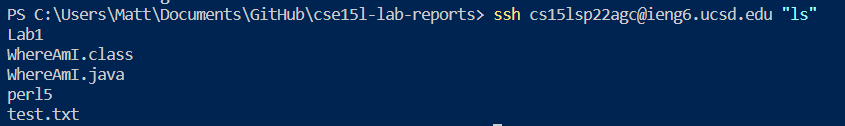

# CSE15L Week 1 & 2 Lab Report

## Installing VSCode

---

To download Visual Studio Code, go to [VSCode Download](https://code.visualstudio.com/download) and select the version that is suitable to your OS system.

Afterwards, follow the installation instructions and open VSCode.

When opening it up for the first time, you should see something similar to this



## Remotely Connecting

---

Next Step is to connect to a remote client through your own laptop/desktop.

1. open up a terminal, for example CMD/Powershell on Windows.
2. Enter ` ssh [Your Username here]@ieng6.ucsd.edu`
3. Enter your password after the computer prompt you
4. You should be connected to the remote client now

You should be able to see something similar to this on your terminal:



When connecting to the remote client for the first time, the following message may pop up on your terminal:



Type `no` in your client and you should be able to proceed.

## Trying Some Commands

---

After connecting to the remote client, you now can try some commands to interact with the remote client.

A few commands that you can try are: `ls, cat, touch`.

- **ls**

    This command list out all the files within a client, or within a specific directory.

    This image is an example output of that command

    
    
- **cat**

    This command allows you to view a file within the remote client.

    This image is an example output of that command, it shows the content of `WhereAmI.java` which is stored remotely.

    

- **touch**

    This command allows you to create a new file on the remote client

    This image is an example output of that command. Notice that there's now a new file named `test.txt` on the client.

    

- **exit**

    This command logs you out of the remote client.

    This image is an example output of that command.

    

## Moving Files with `scp`

---

The `scp` command allows you to move a file from you local client to a remote client.

This command is always executed on your local client, so you need to first log out of the remote client.

The format for the `scp` command is as follow:

`scp [file name on your local client] [destination on the remote client]`

The file name on your local client can be just the file name, or the complete directory to that file.

Afterwards, the terminal will prompt you to enter the password. If the name of your file that is moved pops up next, then this action is successful.

You should be seeing something similar on your terminal:



Now, if you log in to your remote client and type `ls`, you should be able to see your file there.

## Setting up an SSH Key

---

By setting up an SSH key, you can bypass the password section and directly enter your remote client. This can save quite a bit of time as entering password everytime you try to log in is time-consuming and annoying.

Follow the following steps to set up an SSH key:


1. Type ` ssh-keygen` on your local client. (All steps here should be done on your local client)
2. The terminal will output the following:
    ```
    Generating public/private rsa key pair.
    Enter file in which to save the key (/Users/<user-name>/.ssh/id_rsa):
    ```
3. Type `/Users/[Username]/ssh/id_rsa` on your terminal

    The terminal will now output the following:
    ```
    Enter passphrase (empty for no passphrase):
    ```
4. Do not enter anything, just press "enter". The terminal will prompt your to reenter the passphrase, again, do not enter anything and press "enter.
5. If the terminal outputs a `key fingerprint` and a `key's randomart image`, then you have successfully set up an SSH key.

If you now try to log in your remote client, you shouldn't need to enter your password.

A similar situation to the following should show up on your terminal:



## Optimizing Remote Running

---

There are some methods that allows remote operations to be even more efficient.

For example, you can directly put a command in quotation marks in your `ssh` command.




