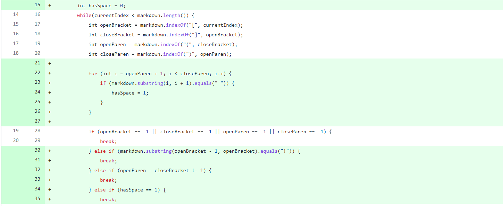

# CSE15L Week 3 & 4 Lab Report

## Change 1

[Input File](https://github.com/Mashyuf/markdown-parser/blob/main/test-file2.md)

Output Result:

The symptom shows that the program is stuck inside an infinite loop. This is caused by the program being unable to find the next openBracket, returning -1 for the functions below, and thus causing it to be stuck. So we added a if statement that checks if the program can find a next openBracket. If the program cannot find it, then it will break the while loop.

## Change 2

[Input File](https://github.com/Mashyuf/markdown-parser/blob/main/test-file2.md)

Output Result:

A similar sympton was outputted in Change 1, it still shows that the program was stuck on an infinite loop. This is because we forgot that the input file was not missing an openBracket, but an openParen. So to mitigate this problem, we added three more conditions in the if statement, checking if the program a find the next openBrakcet, closeBracket, openParen, and closeParen. We also moved the if statement to be after all indexof functions.

## Change 3

[Input File](https://github.com/Mashyuf/markdown-parser/blob/main/test-file3.md)

Output Result:

The output may look alright at first, but it is wrong fundamentally. Links is different from images in markdown, so a program that is designed to only return links from a markdown file shouldn't be able to return image links as well. So the sympton demonstrated here is the fact the program return a image link when it is not suppose to do so.
To fix this program, we added more conditions to the if statement. It currently tests if there is an exclamation mark before the openBracket, if there is, the program will break. As that is an indication that link is an image link. We also added other checks for other edge cases, including testing if there is a space within the URL of a link, and checking if the openParen is right next to the closeBracket. 