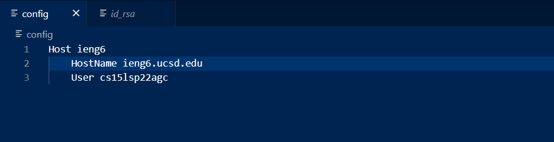
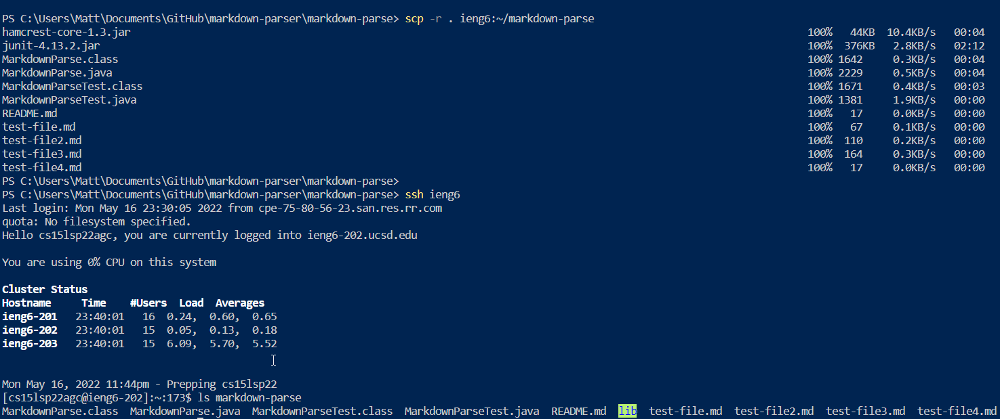

# CSE15L Week 5 & 6 Lab Report

## Streamlining ssh Configuration

----

## Set up Github access ieng6

----

This file is where my private key is stored

## Copy whole directory with scp -r

----

