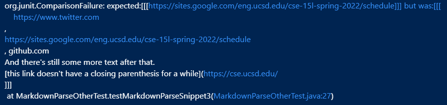

# CSE15L Week 5 & 6 Lab Report

## Code Snippet 1
----

<p align="center">
<em>Expected output for code snippet 1</em>
</p>

```
@Test
    public void testMarkdownParseSnippet1() throws IOException {
        Path fileName = Path.of("test-file5.md");
        String content = Files.readString(fileName);
        assertEquals("[`google.com, google.com, ucsd.edu]", MarkdownParse.getLinks(content).toString());
    } 
```
<p align="center">
<em>JUnit test for code snippet 1 in MarkdownParseTest.java</em>
</p>

The test did not pass for my implementation of MarkdownParse.java on code snippet 1.


<p align="center">
<em>JUnit output for snippet 1 for my implementation</em>
</p>

The test did not pass either for the implementation of MarkdownParse.java that I reviewed on code snippet 1.


<p align="center">
<em>JUnit output for snippet 1 for the reviewed implementation</em>
</p>

## Code Snippet 2
----

<p align="center">
<em>Expected output for code snippet 2</em>
</p>

```
@Test
    public void testMarkdownParseSnippet2() throws IOException {
        Path fileName = Path.of("test-file6.md");
        String content = Files.readString(fileName);
        assertEquals("[a.com, a.com(()), example.com]", MarkdownParse.getLinks(content).toString());
    }
```
<p align="center">
<em>JUnit test for code snippet 2 in MarkdownParseTest.java</em>
</p>

The test did not pass for my implementation of MarkdownParse.java on code snippet 2.


<p align="center">
<em>JUnit output for snippet 2 for my implementation</em>
</p>

The test did not pass either for the implementation of MarkdownParse.java that I reviewed on code snippet 2.


<p align="center">
<em>JUnit output for snippet 2 for the reviewed implementation</em>
</p>

## Code Snippet 3
---

<p align="center">
<em>Expected output for code snippet 3</em>
</p>

```
@Test
    public void testMarkdownParseSnippet3() throws IOException {
        Path fileName = Path.of("test-file7.md");
        String content = Files.readString(fileName);
        assertEquals("[https://sites.google.com/eng.ucsd.edu/cse-15l-spring-2022/schedule]", MarkdownParse.getLinks(content).toString());
    } 
```

<p align="center">
<em>JUnit test for code snippet 3 in MarkdownParseTest.java</em>
</p>

The test did not pass for my implementation of MarkdownParse.java on code snippet 3.


<p align="center">
<em>JUnit output for snippet 3 for my implementation</em>
</p>

The test did not pass either for the implementation of MarkdownParse.java that I reviewed on code snippet 3.


<p align="center">
<em>JUnit output for snippet 3 for the reviewed implementation</em>
</p>

## Reflection
----
1. I do not think there's a small code change that will make snippet 1 and related cases to work. Not only I need to add a code that open brackets and parenthesis after a backtick should not be counted, I also need to add a code that check if there is a bracket within two backticks that is within a set of brackets. There is too many things to check for this to properly function, that I don't think it is possible for it to be done within 10 lines.

2. I don't think a short code can be added to fix this issue either. There still too many things to be checked in order for this issue to be resolved. The code that need to be added needs to check whether there are nested links within a set of brackets, whether there are nested parenthesis within a set of parenthesis, and whether there are escaped brackets. 

3. I think there could be a short code that can fix all the issues regarding line breaks. I just need to check if there are line breaks without blank lines within a markdown file. If there is, allow it to produce an output, and that should solve ths issue. 
