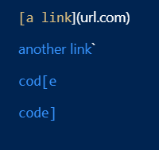
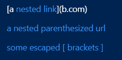
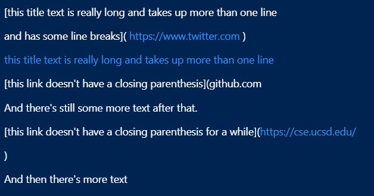

# CSE15L Week 5 & 6 Lab Report

## Code Snippet 1
----

<em>Expected output for code snippet 1</em>

## Code Snippet 2
----

<em>Expected output for code snippet 2</em>

## Code Snippet 3
---

<em>Expected output for code snippet 3</em>

