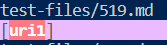

# CSE Week 9 & 10 Lab Report

I used vimdiff to compare the two different txt files that contains the results.

## Test 1
----

[Test File 490](https://github.com/nidhidhamnani/markdown-parser/blob/main/test-files/490.md)

This is the link to one of the test cases that produced a different result between the two markdownparse implementation

----

The implementation from the provided repository is correct.

<em>Output for test file 490 for my own implemenation</em>

<em>Output for test file 490 for my the provided implemenation</em>

<em>Markdown preview for test file 490</em>

The correct output should not contain any links, thus it should be ` [] `

The bug within my implementation is that we didn't consider the situation which the links are wrapped with "<" and ">". These symbols will make a link to not show up in markdown, thus 

should be changed by adding a new else if statement to check wether those symbols wraps around a link.

## Test 2
----

[Test File 519](https://github.com/nidhidhamnani/markdown-parser/blob/main/test-files/519.md)

This is the link to one of the test cases that produced a different result between the two markdownparse implementation

----

My implementation of markdownparse is correctfor this test file

<em>Output for test file 519 for my own implemenation</em>

<em>Output for test file 519 for my the provided implemenation</em>

<em>Markdown preview for test file 519</em>

The correct output should not contain any links, thus it should be ` [] `

The bug with the provided implementation is that it doesn't check whether a link in the markdown file is an actual link or an image. Thus 
should add another check within the if statement to see whether there exists a exclamation mark in the markdown file.