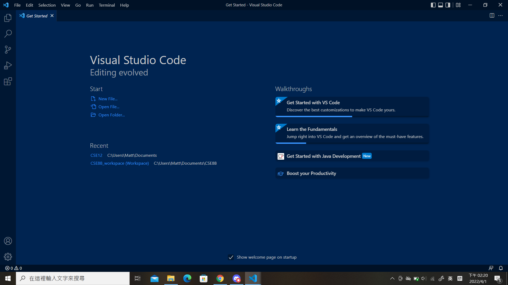
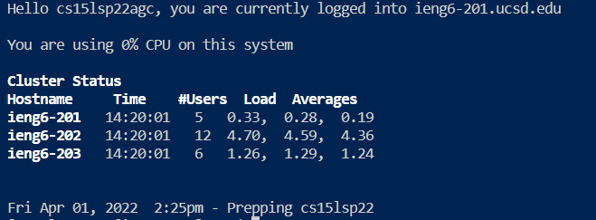

# CSE15L Week 1 & 2 Lab Report

## Installing VSCode

---

To download Visual Studio Code, go to [VSCode Download](https://code.visualstudio.com/download) and select the version that is suitable to your OS system.

Afterwards, follow the installation instructions and open VSCode.

When opening it up for the first time, you should see something similar to this

## Remotely Connecting

---

Next Step is to connect to a remote client through your own laptop/desktop.

1. open up a terminal, for example CMD/Powershell on Windows.
2. Enter ` ssh [Your Username here]@ieng6.ucsd.edu`
3. Enter your password after the computer prompt you
4. You should be connected to the remote client now

You should be able to see something similar to this on your terminal

